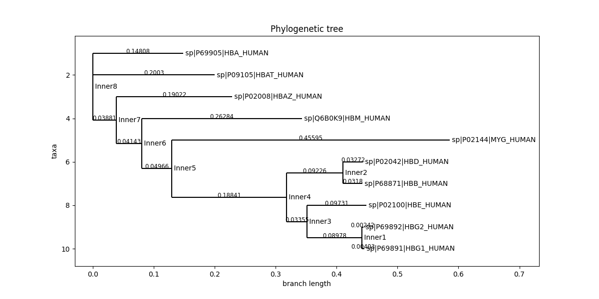

# Phylogenetic-Tree
This tool returns a distance phylogenetic tree from alignment in FASTA format. 


#### ####

**Input:** A FASTA alignment file with three or more sequences. The sequences can be DNA, RNA or protein. 

**Output:** The phylogenetic tree is build in either Neighbor-Joining approach or UPGMA approach. 

### Example: 

**Input:**

```
>pdb|5FXR|A Chain A, INSULIN-LIKE GROWTH FACTOR 1 RECEPTOR
------------------------------------------------------------
------------------------------------------------------------
------------------GYFSAADVYVPDEWEVAREKITMSRELGQGSFGMVYEGVAKG
VVKDEPETRVAIKTVNEAASMRERIEFLNEASVMKEFNCHHVVRLLGVVSQGQPTLVIME
LMTRGDLKSYLRSLRPEMEN----------------------------------------
---------------------NPVLAPPSLSKMIQMAGEIADGMAYLNANKFVHRDLAAR
NCMVAEDFTVKIGDFGMTRDIYETDYYRKGGKGLLPVRWMSPESLKDGVFTTYSDVWSFG
VVLWEIATLAEQPYQGLSNEQVLRFVMEGGLLDKPDNCPDMLFELMRMCWQYNPKMRPSF
LEIISSIKEEMEPGFREVSFYYSEENK---------------------------------
----------------------------------------------------

>pdb|5FXS|A Chain A, INSULIN-LIKE GROWTH FACTOR 1 RECEPTOR
------------------------------------------------------------
------------------------------------------------------------
------------------SYFSAADVYVPDEWEVAREKITMSRELGQGSFGMVYEGVAKG
VVKDEPETRVAIKTVNEAASMRERIEFLNEASVMKEFNCHHVVRLLGVVSQGQPTLVIME
LMTRGDLKSYLRSLRPEMEN----------------------------------------
---------------------NPVLAPPSLSKMIQMAGEIADGMAYLNANKFVHRDLAAR
NCMVAEDFTVKIGDFGMTRAIYETDYYRKGGKGLLPVRWMSPESLKDGVFTTYSDVWSFG
VVLWEIATLAEEPYQGLSNEQVLRFVMEGGLLDKPDNCPDMLFELMRMCWQYNPKMRPSF
LEIISSIKEEMEPGFREVSFYYSEENK---------------------------------
----------------------------------------------------
>pdb|5FXQ|A Chain A, INSULIN-LIKE GROWTH FACTOR 1 RECEPTOR
------------------------------------------------------------
------------------------------------------------------------
------------------SYFSAADVYVPDEWEVAREKITMSRELGQGSFGMVYEGVAKG
VVKDEPETRVAIKTVNEAASMRERIEFLNEASVMKEFNCHHVVRLLGVVSQGQPTLVIME
LMTRGDLKSYLRSLRPEMEN----------------------------------------
---------------------NPVLAPPSLSKMIQMAGEIADGMAYLNANKFVHRDLAAR
NCMVAEDFTVKIGDFGMTRDIYETDYYRKGGKGLLPVRWMSPESLKDGVFTTYSDVWSFG
VVLWEIATLAEQPYQGLSNEQVLRFVMEGGLLDKPDNCPDMLFELMRMCWQYNPKMRPSF
LEIISSIKEEMEPGFREVSFYYSEENK---------------------------------
----------------------------------------------------
>pdb|1M7N|A Chain A, Insulin-like growth factor I receptor
------------------------------------------------------------
------------------------------------------------------------
------------MASVNPEYFSAADVYVPDEWEVAREKITMSRELGQGSFGMVYEGVAKG
VVKDEPETRVAIKTVNEAASMRERIEFLNEASVMKEFNCHHVVRLLGVVSQGQPTLVIME
LMTRGDLKSYLRSLRPEME-----------------------------------------
--------------------NNPVLAPPSLSKMIQMAGEIADGMAYLNANKFVHRDLAAR
NCMVAEDFTVKIGDFGMTRDIYETDYYRKGGKGLLPVRWMSPESLKDGVFTTYSDVWSFG
VVLWEIATLAEQPYQGLSNEQVLRFVMEGGLLDKPDNCPDMLFELMRMCWQYNPKMRPSF
LEIISSIKEEMEPGFREVSFYYSEENKLPEPEELD-------------------------
----------------------------------------------------
```

**Output:**


